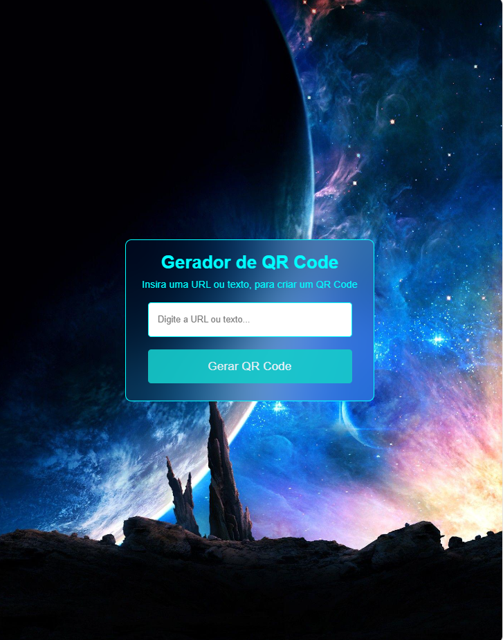

# Gerador de QR Code

Este projeto permite a criação de códigos QR a partir de links e textos de forma fácil e rápida. Com uma interface intuitiva, você pode inserir qualquer URL ou mensagem e gerar um código QR correspondente.

## Sobre

O gerador de QR Code utiliza uma API para criar códigos QR, oferecendo feedback visual ao usuário. O código é encapsulado em uma função autoexecutável para evitar conflitos no escopo global. O projeto inclui tratamento de erros e validação de entrada para uma experiência de usuário aprimorada.

